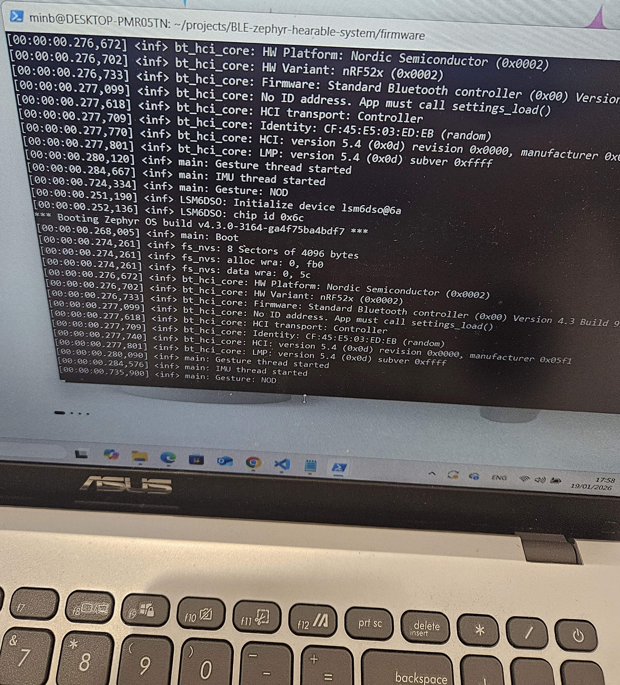
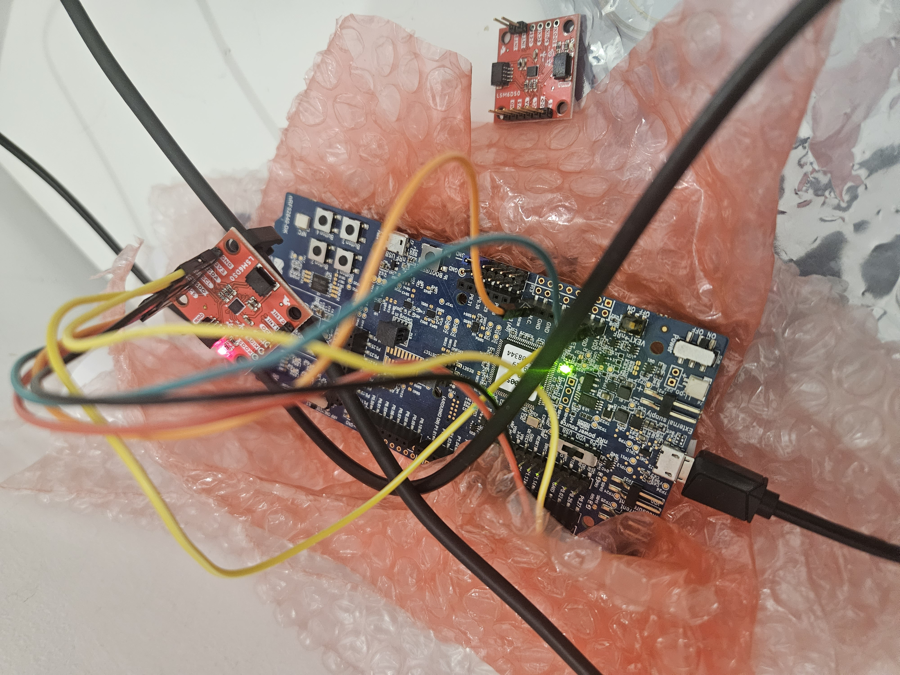

# BLE-zephyr-hearable-system

Zephyr RTOS–based BLE hearable system using **nRF52840**.  
IMU-based gesture detection with a custom BLE GATT service, low-power design, and MCUboot OTA rollback support.

---

## Project Status (Current)

- IMU (LSM6DSO) driver integration ✅
- Multi-threaded design (IMU thread + Gesture thread) ✅
- Message queue–based data pipeline (`k_msgq`) ✅
- State-based gesture detection (LEFT / RIGHT / NOD) with debounce ✅
- Gesture stability verified via serial logs ✅
- BLE GATT service (custom 128-bit UUID + Notify worker + CCC) ✅
- OTA / MCUboot rollback ⏳

>  Development is temporarily blocked due to a **WSL2 environment failure**  
> (see *Known Issues* section below).

---

## Demo (Week 2 – Gesture Detection)

### Gesture Detection Demo



or

 [Watch demo video](docs/gesture_demo_3s_tiny.mp4)

**Detected gestures**
- LEFT (X-axis acceleration)
- RIGHT (X-axis acceleration)
- NOD (Y-axis acceleration)

---
---

## Demo (Week 3 – BLE Gesture Notify)

Week 3 integrates the gesture pipeline with a custom 128-bit BLE GATT service.  
Detected gestures are transmitted in real time to a mobile device via **BLE Notify** using a workqueue-driven architecture.

###  BLE Gesture Notify Pipeline

LSM6DSO → IMU Thread → sample_queue → Gesture Thread → gesture_queue → BLE Notify Worker → nRF Connect

---

###  Proof 1 — Hardware Setup (nRF52840 + LSM6DSO)


Real hardware prototype with nRF52840 DK and LSM6DSO IMU sensor.

---

###  Proof 2 — nRF Connect Receiving Notifications


Custom 128-bit GATT service (`abcdef0`) and characteristic (`abcdef1`)  
CCC enabled → **Notifications received (5-byte payload)**

Payload format:
byte0 = gesture type (1=NOD, 2=LEFT, 3=RIGHT)
byte1~4 = timestamp (LE32)


---

###  Proof 3 — UART Logs Showing Full Pipeline



Key lines:
Notifications enabled
Notified: type=1 ts=724


This confirms the complete RTOS → Queue → BLE worker → Notify data path.

---

###  Short Demo Video (3 seconds)

[▶ Watch BLE Notify demo](docs/20260130_203237.mp4)

Gesture → BLE → Phone in real time.

---

## System Architecture

LSM6DSO (IMU)
│
▼
IMU Thread (100 Hz)
│ struct imu_sample
▼
k_msgq (sample_queue)
│
▼
Gesture Thread
│ state-based detection + debounce
▼
k_msgq (gesture_queue)
│
├── Serial log output (Week 2)
└── BLE Indication (Week 3)

yaml
Copy code

---

## Development Environment

- Host OS: Windows 11
- Linux: WSL2 (Ubuntu)
- RTOS: Zephyr OS
- Board: nRF52840 DK
- Sensor: LSM6DSO (I2C)
- Toolchain: Zephyr SDK (arm-zephyr-eabi)

---

## Known Issue: WSL2 Filesystem I/O Failure (Blocking)

### Problem Summary

During development, a **critical filesystem I/O failure** occurred inside the WSL2 (Ubuntu) environment.  
This failure prevents execution of basic Linux binaries and blocks further development.

This issue is **not related to application code or Zephyr configuration**.

---

### Observed Symptoms

All standard Linux commands fail with `Input/output error`, even when using absolute paths:

```text
/bin/ls
/bin/pwd
/usr/bin/df
/usr/bin/uptime
/usr/bin/which
Example error output:

text
Copy code
-bash: /bin/ls: Input/output error
Previously functional tools (west, ls, df) suddenly became unreadable.

Environment State
OS: Windows + WSL2 (Ubuntu)

Zephyr SDK and workspace were installed and previously functional

Issue occurred after partial Zephyr build attempts

WSL distribution appeared as Stopped

After restart, filesystem I/O errors persisted

Initial Diagnosis
Based on observed behavior:

❌ Not a PATH or shell configuration issue

❌ Not related to application source code

❌ Not related to Zephyr configuration

Highly likely causes:

Corrupted WSL virtual disk (ext4.vhdx)

Windows-side filesystem or storage instability

Unexpected WSL shutdown during active disk I/O

❗ Known Issue: Zephyr SDK Toolchain Crash on WSL2 (ICE)
Summary
On WSL2 (Ubuntu), west build may fail before any application code is compiled.
CMake cannot validate the toolchain because the Zephyr SDK compiler crashes during a dummy try-compile step.

This is a host environment / toolchain stability issue, not an application logic problem.

Symptoms / Evidence
Errors observed in build/CMakeFiles/CMakeConfigureLog.yaml:

text
Copy code
arm-zephyr-eabi-g++: error: unrecognized command-line option '--target=arm-arm-none-eabi'
arm-zephyr-eabi-gcc: internal compiler error: Segmentation fault (cc1)
arm-zephyr-eabi-g++: internal compiler error: Segmentation fault (cc1plus)
Impact
west build cannot proceed

Failure occurs before compiling project source files

Indicates SDK or WSL instability

Quick Verification (Compiler Self-Test)
bash
Copy code
cat > /tmp/t.c <<'EOF'
int main(void){return 0;}
EOF

$ZEPHYR_SDK_INSTALL_DIR/arm-zephyr-eabi/bin/arm-zephyr-eabi-gcc \
  -c /tmp/t.c -o /tmp/t.o
If this fails, the environment is considered corrupted.

 Planned Recovery Steps
Shutdown WSL completely:

bash
Copy code
wsl --shutdown
Reinstall or re-extract Zephyr SDK

Clear Zephyr cache and build directory:

bash
Copy code
rm -rf ~/.cache/zephyr
rm -rf build
Rebuild project:

bash
Copy code
west build -p auto -b nrf52840dk/nrf52840
If the issue persists:

Recreate the WSL Ubuntu distribution, or

Migrate to a native Linux environment

 Repository Safety Note
All project source code is version-controlled in GitHub.
No source code loss is expected.

After environment recovery, restore the workspace by re-cloning:

bash
Copy code
git clone https://github.com/minoverse/BLE-zephyr-hearable-system.git
 Next Milestones
 Refactor gesture logic into gesture.c / gesture.h

 BLE GATT notify/indicate for gesture events

 Power optimization (sleep states, sensor ODR tuning)

 Audio DMA (PDM) + ring buffer

 MCUboot OTA rollback integration
