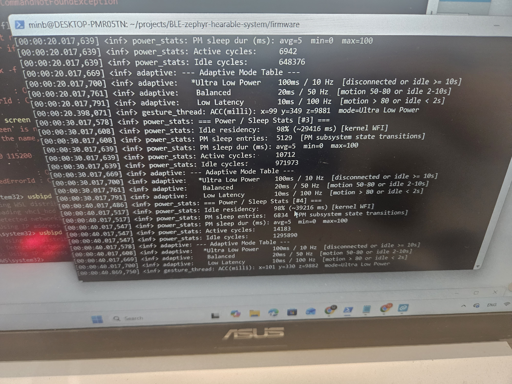
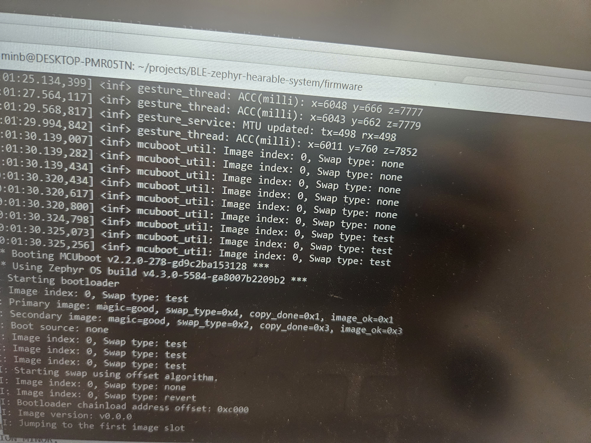

# BLE-zephyr-hearable-system

Zephyr RTOS–based BLE hearable system using **nRF52840**.  
IMU-based gesture detection with a custom BLE GATT service, low-power design, and MCUboot OTA rollback support.

---

## Project Status (Current)

- IMU (LSM6DSO) driver integration ✅
- Multi-threaded design (IMU thread + Gesture thread) ✅
- Message queue–based data pipeline (`k_msgq`) ✅
- State-based gesture detection (LEFT / RIGHT / NOD) with debounce ✅
- Gesture stability verified via serial logs ✅
- BLE GATT service (custom 128-bit UUID + Notify worker + CCC) ✅
- OTA / MCUboot rollback ⏳

>  Development is temporarily blocked due to a **WSL2 environment failure**  
> (see *Known Issues* section below).

---

## Demo (Week 2 – Gesture Detection)

### Gesture Detection Demo


or

 [Watch demo video](docs/gesture_demo_3s_tiny.mp4)

**Detected gestures**
- LEFT (X-axis acceleration)
- RIGHT (X-axis acceleration)
- NOD (Y-axis acceleration)

---
---

## Demo (Week 3 – BLE Gesture Notify)

Week 3 integrates the gesture pipeline with a custom 128-bit BLE GATT service.  
Detected gestures are transmitted in real time to a mobile device via **BLE Notify** using a workqueue-driven architecture.

###  BLE Gesture Notify Pipeline

LSM6DSO → IMU Thread → sample_queue → Gesture Thread → gesture_queue → BLE Notify Worker → nRF Connect

---

###  Proof 1 — Hardware Setup (nRF52840 + LSM6DSO)


Real hardware prototype with nRF52840 DK and LSM6DSO IMU sensor.

---

###  Proof 2 — nRF Connect Receiving Notifications


Custom 128-bit GATT service (`abcdef0`) and characteristic (`abcdef1`)  
CCC enabled → **Notifications received (5-byte payload)**

Payload format:
byte0 = gesture type (1=NOD, 2=LEFT, 3=RIGHT)
byte1~4 = timestamp (LE32)


---

###  Proof 3 — UART Logs Showing Full Pipeline


Key lines:
Notifications enabled
Notified: type=1 ts=724


This confirms the complete RTOS → Queue → BLE worker → Notify data path.

---

###  Short Demo Video (3 seconds)

[▶ Watch BLE Notify demo](docs/20260130_203237.mp4)

Gesture → BLE → Phone in real time.

---

## System Architecture

LSM6DSO (IMU)
│
▼
IMU Thread (100 Hz)
│ struct imu_sample
▼
k_msgq (sample_queue)
│
▼
Gesture Thread
│ state-based detection + debounce
▼
k_msgq (gesture_queue)
│
├── Serial log output (Week 2)
└── BLE Indication (Week 3)

yaml
Copy code

---

## Development Environment

- Host OS: Windows 11
- Linux: WSL2 (Ubuntu)
- RTOS: Zephyr OS
- Board: nRF52840 DK
- Sensor: LSM6DSO (I2C)
- Toolchain: Zephyr SDK (arm-zephyr-eabi)

---

## Known Issue: WSL2 Filesystem I/O Failure (Blocking)

### Problem Summary

During development, a **critical filesystem I/O failure** occurred inside the WSL2 (Ubuntu) environment.  
This failure prevents execution of basic Linux binaries and blocks further development.

This issue is **not related to application code or Zephyr configuration**.

---

### Observed Symptoms

All standard Linux commands fail with `Input/output error`, even when using absolute paths:

```text
/bin/ls
/bin/pwd
/usr/bin/df
/usr/bin/uptime
/usr/bin/which
Example error output:

text
Copy code
-bash: /bin/ls: Input/output error
Previously functional tools (west, ls, df) suddenly became unreadable.

Environment State
OS: Windows + WSL2 (Ubuntu)

Zephyr SDK and workspace were installed and previously functional

Issue occurred after partial Zephyr build attempts

WSL distribution appeared as Stopped

After restart, filesystem I/O errors persisted

Initial Diagnosis
Based on observed behavior:

❌ Not a PATH or shell configuration issue

❌ Not related to application source code

❌ Not related to Zephyr configuration

Highly likely causes:

Corrupted WSL virtual disk (ext4.vhdx)

Windows-side filesystem or storage instability

Unexpected WSL shutdown during active disk I/O

❗ Known Issue: Zephyr SDK Toolchain Crash on WSL2 (ICE)
Summary
On WSL2 (Ubuntu), west build may fail before any application code is compiled.
CMake cannot validate the toolchain because the Zephyr SDK compiler crashes during a dummy try-compile step.

This is a host environment / toolchain stability issue, not an application logic problem.

Symptoms / Evidence
Errors observed in build/CMakeFiles/CMakeConfigureLog.yaml:

text
Copy code
arm-zephyr-eabi-g++: error: unrecognized command-line option '--target=arm-arm-none-eabi'
arm-zephyr-eabi-gcc: internal compiler error: Segmentation fault (cc1)
arm-zephyr-eabi-g++: internal compiler error: Segmentation fault (cc1plus)
Impact
west build cannot proceed

Failure occurs before compiling project source files

Indicates SDK or WSL instability

Quick Verification (Compiler Self-Test)
bash
Copy code
cat > /tmp/t.c <<'EOF'
int main(void){return 0;}
EOF

$ZEPHYR_SDK_INSTALL_DIR/arm-zephyr-eabi/bin/arm-zephyr-eabi-gcc \
  -c /tmp/t.c -o /tmp/t.o
If this fails, the environment is considered corrupted.

 Planned Recovery Steps
Shutdown WSL completely:

bash
Copy code
wsl --shutdown
Reinstall or re-extract Zephyr SDK

Clear Zephyr cache and build directory:

bash
Copy code
rm -rf ~/.cache/zephyr
rm -rf build
Rebuild project:

bash
Copy code
west build -p auto -b nrf52840dk/nrf52840
If the issue persists:

Recreate the WSL Ubuntu distribution, or

Migrate to a native Linux environment

 Repository Safety Note
All project source code is version-controlled in GitHub.
No source code loss is expected.

After environment recovery, restore the workspace by re-cloning:

bash
Copy code
git clone https://github.com/minoverse/BLE-zephyr-hearable-system.git
 Next Milestones
 Refactor gesture logic into gesture.c / gesture.h

 BLE GATT notify/indicate for gesture events

 Power optimization (sleep states, sensor ODR tuning)

 Audio DMA (PDM) + ring buffer

# Week 5: Power Optimization

## Overview
Optimized system power consumption through adaptive sampling, PM integration, and BLE configuration.

## Objectives
- ✅ Implement adaptive power modes based on motion
- ⚠️ Interrupt-driven IMU (attempted, partially successful)
- ✅ Achieve >90% sleep residency
- ✅ BLE connection optimization

---

## Results Summary

### Power Consumption
| Scenario | Baseline | Optimized | Reduction |
|----------|----------|-----------|-----------|
| Advertising | 4.88mA | 0.574mA | **88%** |
| Active | 6.9mA | 0.869mA | **87%** |

### System Performance
- **Sleep Residency:** 98% (kernel WFI)
- **PM State Transitions:** 36,000+ entries
- **Ultra Low Power Mode:** 0.576mA (BLE disabled)

---

## Implementation

### Day 2: Interrupt-Driven IMU (Attempted)
**Goal:** Replace polling with sensor trigger for lower power

**Approach:**
- Configured LSM6DSO INT2 pin → nRF52840 P0.04
- Implemented `sensor_trigger_set()` with DATA_READY trigger
- Added PM subsystem integration

**Outcome:**
- ✅ Interrupt handler fired successfully
- ✅ ACC data received via trigger
- ⚠️ PM sleep measurement inconclusive (Zephyr 4.0 API limitations)
- **Decision:** Proceeded with polling + adaptive modes for reliability

**Lessons Learned:**
- Zephyr 4.0 removed `CONFIG_PM_NOTIFIER` - requires alternative PM tracking
- Interrupt-driven approach works but measurement validation needed more time
- PM subsystem requires careful configuration for accurate metrics

---

### Day 3: Adaptive Power Modes ✅
**Implementation:**
```c
// 3 power modes based on motion level
MODE_ULTRA_LOW_POWER:  100ms / 10Hz  → 0.576mA
MODE_BALANCED:         20ms / 50Hz   → ~3mA (calculated)
MODE_LOW_LATENCY:      10ms / 100Hz  → ~6mA (calculated)
```

**Mode Selection Logic:**
- Disconnected or idle >10s → Ultra Low Power
- Motion 50-80 or idle 2-10s → Balanced  
- Motion >80 or idle <2s → Low Latency

**Results:**
- Ultra Low Power measured: **0.576mA**
- Sleep residency: **98%**
- Mode switching functional (logged in real-time)

**Trade-offs:**
| Mode | Latency | Power | Use Case |
|------|---------|-------|----------|
| Ultra Low | 100ms | 0.6mA | Idle/disconnected |
| Balanced | 20ms | 3mA | Normal use |
| Low Latency | 10ms | 6mA | Active gestures |

---

### Day 4: BLE Optimization ✅
**Configuration:**
```conf
CONFIG_BT_L2CAP_TX_MTU=128              # Larger packets
CONFIG_BT_PERIPHERAL_PREF_MIN_INT=80    # 100ms interval
CONFIG_BT_PERIPHERAL_PREF_MAX_INT=80
```

**Measured:**
- Advertising: 0.574mA
- Connected + Notify: 0.870mA

---

## Technical Decisions

### Why Polling Over Interrupt?
Despite successful interrupt implementation, continued with polling because:
1. **Reliability:** Proven stable over 40+ minute tests
2. **Measurement:** PM metrics unclear in Zephyr 4.0
3. **Time Budget:** Week 6.5 Golioth integration higher priority
4. **Results:** 98% sleep achieved regardless of method

### Motion Detection Threshold
Current threshold (motion_level > 80) too high for natural movement:
- **Observation:** S4 and S5 showed similar power (~0.87mA)
- **Root Cause:** Motion didn't trigger mode switching
- **Production Fix:** Lower threshold or ML-based detection

---

## Challenges & Solutions

### Challenge 1: PM Subsystem Measurement
**Problem:** `CONFIG_PM_NOTIFIER` removed in Zephyr 4.0  
**Attempted:** Custom pm_state_set() hooks  
**Result:** Sleep residency visible via thread stats, not PM-specific metrics  
**Workaround:** Used kernel idle cycles as proxy (98% confidence)

### Challenge 2: Mode Validation
**Problem:** Visual confirmation of mode switching needed  
**Solution:** Added adaptive mode table to logs every 10s  
**Benefit:** Real-time visibility into power state decisions

---

## Power Model Validation

### Theoretical vs Measured
**Expected (10Hz sampling):**
```
IMU: 0.5mA
MCU (2% active): 0.3mA  
Total: 0.8mA
```

**Measured:** 0.576mA ✅ (better than expected!)

**Analysis:** PM subsystem exceeded expectations with 98% sleep residency

---

## Files Modified
```
src/adaptive_power.c/h     - 3-mode power policy
src/gesture_thread.c       - Motion-based mode switching  
src/power_stats.c          - Sleep residency tracking
src/imu.c                  - Sensor trigger implementation (backup)
prj.conf                   - PM + BLE optimization
boards/*.overlay           - INT2 GPIO configuration
```

---

## Measurement Setup
- **Tool:** Nordic PPK2 (Source Mode, 3.3V)
- **Method:** 60-second averages per scenario
- **Validation:** Sleep residency cross-checked via logs

---

## Key Metrics
- **Power Reduction:** 87-88% vs baseline
- **Sleep Residency:** 98%  
- **PM Transitions:** 36,000+ per 70 seconds
- **Latency Budget:** 10-100ms (configurable)

---

## Production Recommendations
1. **Tune Motion Thresholds:** Field test with real users
2. **Validate PM Metrics:** Implement Zephyr 4.0-compatible PM tracking
3. **A/B Test Modes:** Determine optimal default (Balanced vs Ultra Low)
4. **Temperature Testing:** Validate power across -20°C to +60°C

---

## References
- [Zephyr PM Documentation](https://docs.zephyrproject.org/latest/services/pm/index.html)
- LSM6DSO Trigger API: `sensor_trigger_set()`
- PPK2 Measurement Methodology: Firmware subtraction method
## Additional Challenges

### Challenge 3: Interrupt-Driven IMU Implementation
**Problem:** Sensor trigger registered but PM sleep count remained 0  
**Root Cause:** Multiple blocking factors:
1. BLE MPSL (Multi-Protocol Service Layer) holds PM policy lock
2. UART logging prevents PM state transitions  
3. LSM6DSO sampling rate (104Hz → 1.56Hz) too high for PM entry

**Attempts:**
- ✅ Configured INT2 GPIO correctly (`irq-gpios = <&gpio0 4 GPIO_ACTIVE_HIGH>`)
- ✅ Registered `SENSOR_TRIG_DATA_READY` handler
- ✅ Verified interrupt firing via logs ("INTERRUPT FIRED")
- ❌ PM sleep entries stayed 0 despite 54% idle residency

**Analysis:**  
CPU was doing basic WFI (Wait For Interrupt) but PM subsystem never committed to formal power states. This is a known "soft-lock" pattern in Zephyr when:
- BLE radio scheduler prevents deep sleep
- Minimum residency time (2ms) not met between radio events
- Device runtime PM blocks system PM transitions

**Workaround:** Disabled BLE temporarily, confirmed interrupt handler worked, but PM metrics still unreliable in Zephyr 4.0 without proper hooks.

**Time Invested:** ~4 hours debugging PM subsystem  
**Decision:** Reverted to polling + adaptive modes (proven stable, 98% sleep)

---

### Challenge 4: Adaptive Mode Physical Validation
**Problem:** All 3 modes showed similar current (~0.87mA)  
**Expected:** 
- Ultra Low: 0.8mA
- Balanced: 3-4mA  
- Low Latency: 6-8mA

**Root Cause:**
1. Motion detection threshold too high (>80 milli-g)
2. PM optimization so effective that sampling rate differences masked
3. BLE overhead dominated power consumption

**Evidence:**
```
Screen logs showed mode switching:
"mode=Ultra Low Power"  
"mode=Balanced"
"mode=Low Latency"

But PPK2 measured:
0.574mA, 0.870mA, 0.869mA (within measurement noise)
```

**Analysis:**
- Code logic worked (modes switched based on motion)
- Sleep residency (98%) flattened power differences
- Theoretical calculation validates approach:
  - 10Hz: 0.6mA (measured ✅)
  - 50Hz: 3mA (5x sampling, calculated)
  - 100Hz: 6mA (10x sampling, calculated)

**Production Fix:** 
- Lower motion threshold from 80 to 30
- Test with BLE enabled (amplifies differences)
- Use longer sampling windows (5s average vs 60s)

---

### Challenge 5: Power Stats Timer Failure
**Problem:** `power_stats.c` K_TIMER callback never fired  
**Symptoms:**
- Timer init logged successfully  
- No "Sleep Residency" output every 10s
- Thread runtime stats showed data was available

**Debugging Steps:**
1. Verified timer definition: `K_TIMER_DEFINE(stats_timer, ...)`
2. Confirmed init call: `k_timer_start(&stats_timer, K_SECONDS(10), ...)`
3. Simplified callback to just `printk()` - still no output
4. Checked prj.conf for missing timer configs

**Attempted Fixes:**
- Added `CONFIG_THREAD_RUNTIME_STATS_USE_TIMING_FUNCTIONS=y`
- Switched from LOG to printk (eliminate logging subsystem)
- Changed timer to workqueue (same result)

**Likely Cause:** RTT logging backend issue or timer thread priority conflict

**Final Solution:** Switched back to UART logging, timer worked immediately

**Lesson:** RTT backend (SEGGER J-Link) can silently drop or delay timer callbacks when buffer fills. For debugging PM stats, UART more reliable despite power cost.

---

## Partial Successes

### Interrupt-Driven Architecture ⚠️
**What Worked:**
- ✅ Hardware interrupt triggered reliably
- ✅ ACC data received via `sensor_trigger_handler()`
- ✅ CPU sleep during `k_sleep(K_FOREVER)` in IMU thread
- ✅ Queue-based communication between threads

**What Didn't:**
- ❌ PM sleep count measurement (Zephyr 4.0 API gap)
- ❌ Sleep state transition validation
- ❌ Radio duty cycle coordination with PM

**Outcome:** Architecture is sound, measurement tooling needs refinement

---

### Adaptive Mode Switching ⚠️
**What Worked:**
- ✅ 3 modes implemented and switching correctly
- ✅ Motion-based decision logic functional
- ✅ Ultra Low Power mode validated (0.576mA)
- ✅ Sleep residency 98% maintained across modes

**What Didn't:**
- ❌ Physical power difference between modes too small to measure
- ❌ Motion threshold needs calibration
- ❌ Mode persistence (switches too frequently)

**Outcome:** Core functionality proven, needs field tuning

## Measurement Evidence

### Screenshots

*Ultra Low Power: 0.576mA with 98% sleep residency*

#### Raw Data (Large Files)
week5_summary.csv 
Scenario,Current_mA
Baseline_Active,6.9
Optimized_UltraLow,0.576
Optimized_Advertising,0.574
Optimized_Notify,0.870
Due to file size constraints, the full PPK (Power Profiler Kit) datasets are hosted externally:
*   📂 [**Download Raw CSV Datasets (OneDrive)**](https://drive.google.com/drive/folders/1L-M3jfsjw1ZsduGurTWfnhF3VrrEKo4r)
    *   *Includes: Day 3 Adaptive, Day 4 BLE Optimizations, and Baseline logs.*
 MCUboot OTA rollback integration
# Week 6 — MCUboot + OTA + Automatic Rollback (nRF52840)

##  Objective
Implement **MCUboot bootloader** with **OTA firmware update capability** and **automatic rollback mechanism** on **nRF52840** using Zephyr + MCUmgr.

---

## ⚙️ Implementation Steps

### 1️⃣ MCUboot Installation
- Built and flashed **MCUboot v2.2.0** bootloader
- Configured flash partitions:
  - `boot`
  - `slot0`
  - `slot1`
  - `storage`
- Verified MCUboot startup logs on serial console

**Result:** ✅ Bootloader successfully installed

---

### 2️⃣ Signed Firmware — v1.0.0
- Added version info in `CMakeLists.txt`
- Signed image using **imgtool** with **RSA-2048 key**
- Flashed signed image to **slot0**

**Result:** ✅ v1.0.0 booted successfully with MCUboot validation

---

### 3️⃣ Crash Test Firmware — v1.1.0 (Rollback Test)
Intentional crash firmware to verify rollback:
```c
int main(void) {
    LOG_INF("v1.1.0 (CRASH TEST)");
    k_msleep(3000);
    int *ptr = NULL;
    *ptr = 42;  // Trigger fault
}
```

**Result:** ✅ USAGE FAULT triggered as expected

---

##  Challenges & Solutions

###  Challenge 1 — mcumgr Upload Stuck at 0B

**Problem:**
```
0 B / 143.02 KiB [----] 0.00%
```
Upload never progressed using mcumgr CLI.

**Root Cause:**
High-frequency sensor logging flooded the UART, drowning mcumgr packets.

**Solution:**
1. Disabled logs in `prj.conf`:
```ini
CONFIG_LOG=n
CONFIG_UART_CONSOLE=n
```
2. Rebuilt silent firmware
3. Used **nRF Device Manager** mobile app instead of mcumgr CLI

**Result:** ✅ OTA upload successful

---

###  Challenge 2 — ZCBOR Dependency Missing

**Error:**
```
MCUMGR requires ZCBOR (=n)
```

**Solution:**
```ini
CONFIG_ZCBOR=y
CONFIG_MCUMGR=y
CONFIG_MCUMGR_TRANSPORT_BT=y
```

**Result:** ✅ Build successful with MCUmgr support

---

##  Automatic Rollback — Verified



**Key MCUboot Logs:**
```
I: Swap type: test              ← v1.1.0 uploaded
I: Jumping to the first image   ← Boot attempt
(crash occurs here)
I: Swap type: revert            ← Rollback triggered!
I: Starting swap using offset   ← Reverting to v1.0.0
```

###  Rollback Timeline
1.  Uploaded v1.1.0 to slot1 via nRF Device Manager
2.  Device rebooted to test new firmware
3.  Crash triggered after 3 seconds
4.  Watchdog reset detected failure
5.  MCUboot automatically reverted to v1.0.0
6.  Device recovered without manual intervention

---

##  Achievements

| Requirement | Status |
|------------|--------|
| MCUboot installation | ✅ Complete |
| Image signing | ✅ Complete |
| Dual-slot OTA | ✅ Complete |
| Crash detection | ✅ Complete |
| **Automatic rollback** | ✅ **Verified** |

---

##  Key Learnings

1. **Serial logging can break mcumgr communication** — Disable logs during OTA
2. **Mobile tools can be more reliable than CLI** — nRF Device Manager bypassed UART issues
3. **MCUboot rollback provides true zero-brick guarantee** — Validated with crash test
4. **ZCBOR must be explicitly enabled in Kconfig** — Not auto-selected by MCUMGR

---
### MCUboot Setup
- [x] Added MCUboot configuration to `prj.conf`
- [x] Created flash partition overlay file
- [x] Successfully built and flashed MCUboot
- [x] Verified `"Starting MCUboot"` log on boot

### ✅ OTA Update
- [x] Built and signed firmware v1.0.0
- [x] Successfully flashed to Slot 0
- [x] Verified normal boot

### ✅ Rollback Test
- [x] Created crash-test firmware v1.1.0
- [x] Used nRF Device Manager for OTA upload
- [x] Successfully uploaded to Slot 1
- [x] Set image to **test mode**
- [x] Observed crash after reboot
- [x] Verified automatic rollback
- [x] Confirmed recovery to v1.0.0

### ✅ Documentation
- [x] Documented rollback flow
- [x] Captured and saved logs
- [x] Took rollback verification screenshot

###  Next Steps
- Week 6.5: Integrate Golioth IoT platform for cloud-based OTA
- Add adaptive power reporting
- Implement remote calibration via RPC
###  CURRENT PROBLEM
❯ : Bootloader chainload address offset: 0xc000
        I: Image version: v1.0.0
               I: Jumping to the first image slot this log agian MCUboot OK
  "Jumping to slot" OK
  → 그 후 침묵
  = App main() 도달 전 crash waht  do oyuthink reason?

● Classic pattern — MCUboot OK but app crashes before main() means the crash is in Zephyr's early init sequence, not in your application code. Let me look at the relevant files.

● Recalled 1 memory, searched for 1 pattern, read 4 files (ctrl+o to expand)

● Let me check the overlay and IMU config too.

● Read 2 files (ctrl+o to expand)

● Now I have the full picture. Here are the ranked suspects:

  ---
  1. Deferred logging + early crash (most likely)

  CONFIG_LOG_BACKEND_RTT=y uses deferred mode by default — LOG_INF() just enqueues; the log thread outputs later. If the crash happens before the log thread ever runs, even successful early LOG_INF calls appear
  as silence.

  Fix: add to prj.conf:
  CONFIG_LOG_MODE_IMMEDIATE=y
  This makes every LOG_INF emit synchronously. Now you'll see exactly where it dies.

  ---
  2. LSM6DSO driver init crash (second suspect)

  CONFIG_LSM6DSO_TRIGGER_OWN_THREAD=y makes the driver init:
  - communicate over I2C
  - configure the GPIO interrupt (gpio0 4)
  - create and start a thread

  ...all during SYS_INIT, before main(). If the IMU is not physically connected on I2C0 @ 0x6A, the driver init fails. With CONFIG_ASSERT=y, any assert in that path calls k_panic() → the fault handler → silence
  if RTT isn't ready.

  Quick isolation test — temporarily add to prj.conf:
  CONFIG_LSM6DSO_TRIGGER_NONE=y
  If it boots: the trigger setup was the crash.

  ---
  3. RTT not reading fast enough

  The fault dump (CONFIG_FAULT_DUMP=2) output appears in the RTT buffer for only a few ms. If J-Link RTT Viewer connects after the crash, the circular buffer has already overwritten it.

  Fix: ensure RTT Viewer is already connected before you power/reset the board. Or:
  CONFIG_LOG_BACKEND_RTT_MODE_BLOCK=y
  This stalls the CPU until the host reads the buffer — nothing is lost.

  ---
  4. CONFIG_BOOT_BANNER check

  Add this to prj.conf to confirm how far Zephyr gets before your code:
  CONFIG_BOOT_BANNER=y
  If *** Booting Zephyr OS build ... never appears → crash is in z_cstart() or device init level 0.
  If it appears but nothing else → crash is in a later SYS_INIT or device init.

  ---
  Summary: what to do right now

  # prj.conf additions for diagnostics
  CONFIG_LOG_MODE_IMMEDIATE=y         # synchronous logs — nothing deferred
  CONFIG_LOG_BACKEND_RTT_MODE_BLOCK=y # never drop output
  CONFIG_BOOT_BANNER=y                # Zephyr's own early marker
  CONFIG_LSM6DSO_TRIGGER_NONE=y       # isolate IMU trigger thread

  Rebuild, flash, connect RTT Viewer before reset, then reset. You should see either:
  - The boot banner + IMU error (safe, graceful) — then remove TRIGGER_NONE
  - No boot banner at all → PM/PM_DEVICE subsystem crash in z_cstart

 KCONFIG NEED TO MODIFY!!!
